# Linear Regulated 12V Power Supply

## Overview
This project presents the design and simulation of a **12V linear regulated power supply** using **NI Multisim**.

The circuit converts a 230V AC input into a stable 12V DC output through a step-down transformer, bridge rectifier, filter capacitor, and LM7812 voltage regulator.

---

## Final Circuit Diagram

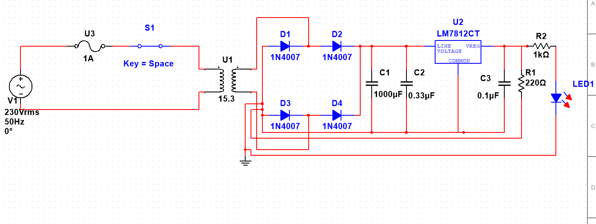

---

## Features

- Converts 230V AC to regulated 12V DC.
- Full-wave bridge rectifier.
- Ripple filtering using electrolytic capacitor.
- LM7812 voltage regulation.
- LED power indicator.
- Simulated using NI Multisim.

## Components Used

- 230V AC Source
- 15.3V Step-down Transformer
- 4 × 1N4007 Diodes (Bridge Rectifier)
- 1000µF Filter Capacitor
- 0.33µF Input Capacitor
- 0.1µF Output Capacitor
- LM7812 Voltage Regulator
- 1A Fuse
- SPST Switch
- 1kΩ Resistor
- 220Ω Load Resistor
- LED Indicator

---

## Working Principle

1. The transformer steps down the input voltage.
2. The bridge rectifier converts AC into pulsating DC.
3. The filter capacitor smooths the rectified voltage.
4. The LM7812 regulates the voltage to approximately 12V DC.
5. The LED indicates that the power supply is operating.

---

## Experimental Results

| Load Resistance | Input Voltage | Output Voltage | Load Current | LED Current |
|---------------:|--------------:|---------------:|-------------:|------------:|
| 1kΩ | 19.313V | 11.899V | 11.899mA | 10.108mA |
| 470Ω | 19.160V | 11.870V | 25.262mA | 10.083mA |
| 220Ω | 18.882V | 11.800V | 53.856mA | 10.058mA |

---

## Measurements

The following measurements were taken during the Multisim simulation.

### Load Resistance = 1 kΩ
#### Input Voltage
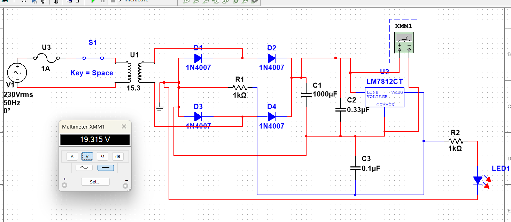

#### Output Voltage
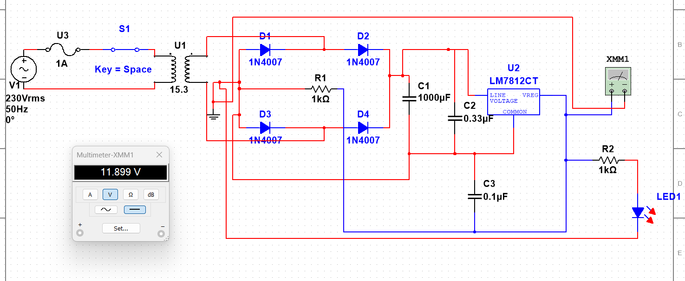

#### Load Current
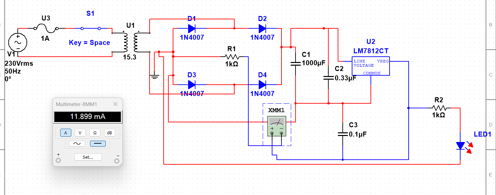

#### LED Current
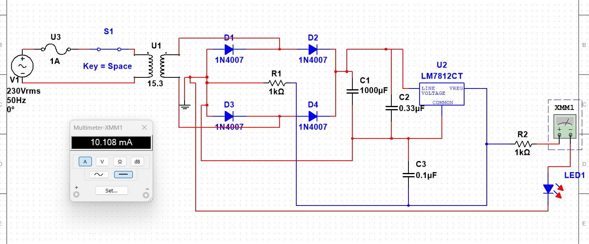

### Load Resistance = 470 Ω
#### Input Voltage
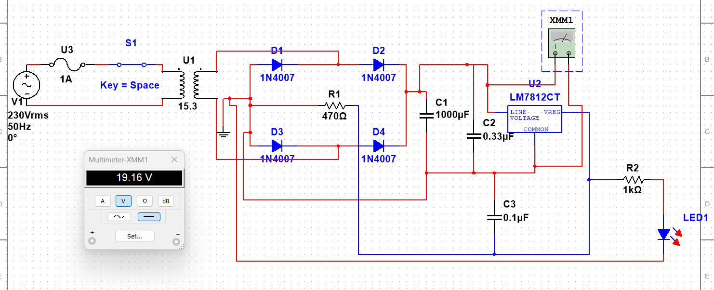

#### Output Voltage
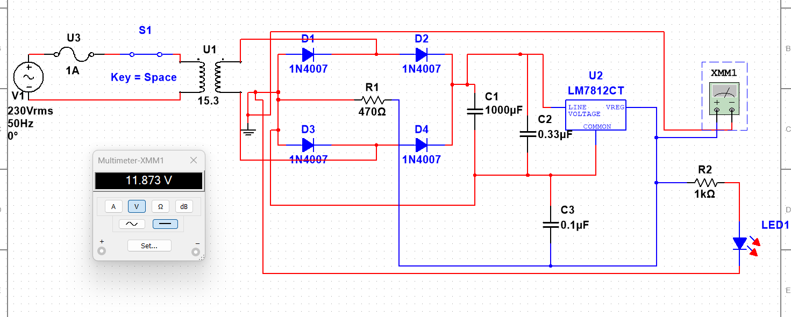

#### Load Current
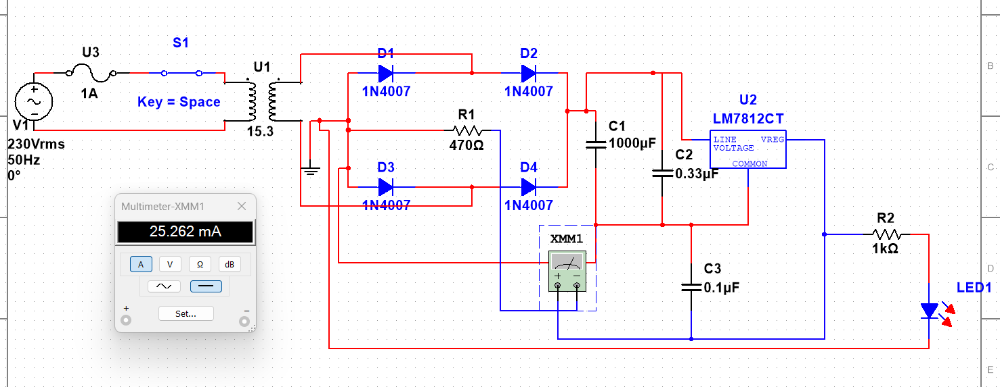

#### LED Current
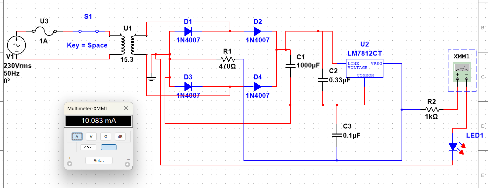

### Load Resistance = 220 Ω
#### Input Voltage
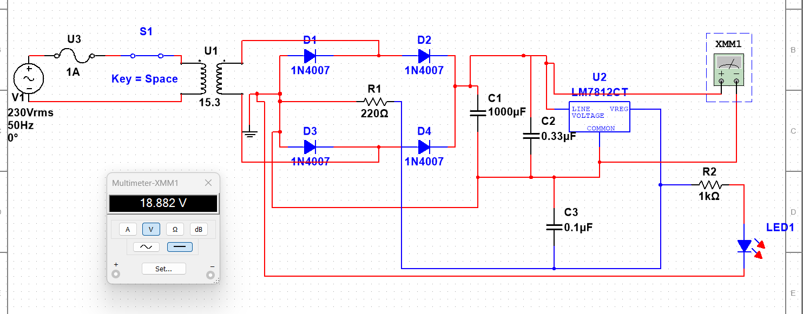

#### Output Voltage
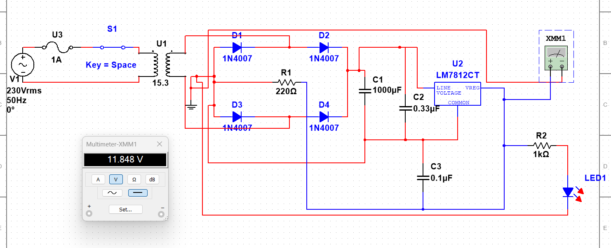

#### Load Current
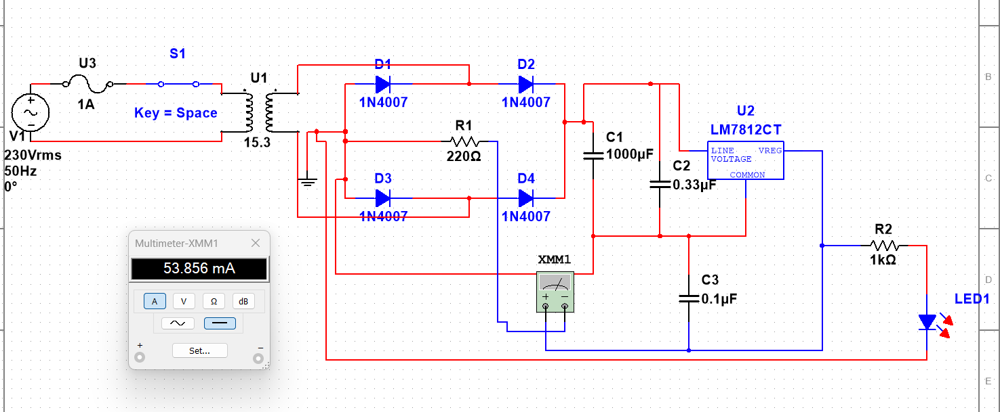

#### LED Current
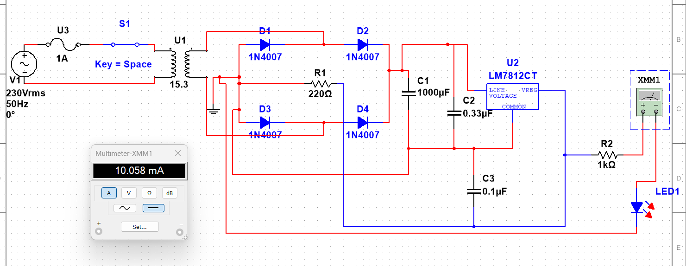
All screenshots are available in the **Measurements** folder.

---

## Conclusion

The simulation demonstrates that the LM7812 voltage regulator maintains an output voltage close to 12V while supplying different load currents. As the load resistance decreases, the load current increases, while the regulator continues to provide a stable output suitable for low-power DC applications.

---

## Software

- NI Multisim
  
---

## Skills Demonstrated

- Electronic Circuit Design
- NI Multisim Simulation
- Bridge Rectifier Design
- Linear Voltage Regulation
- Circuit Testing and Analysis
